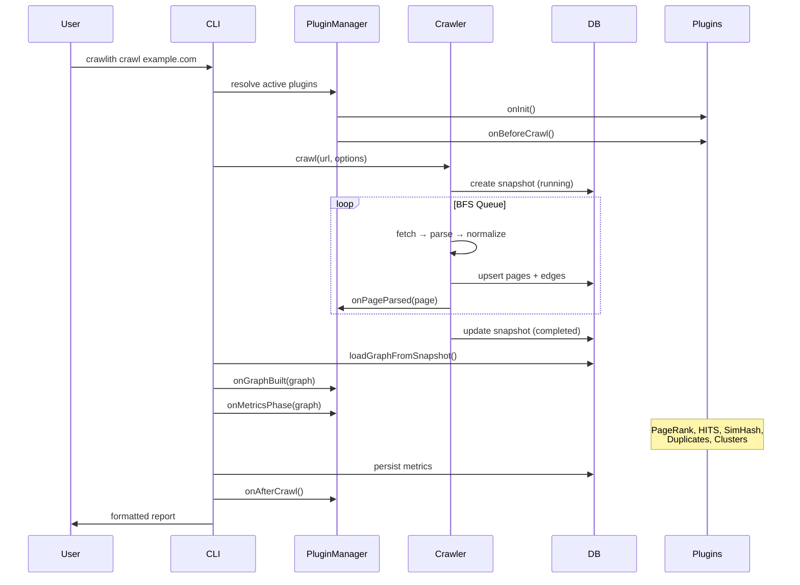
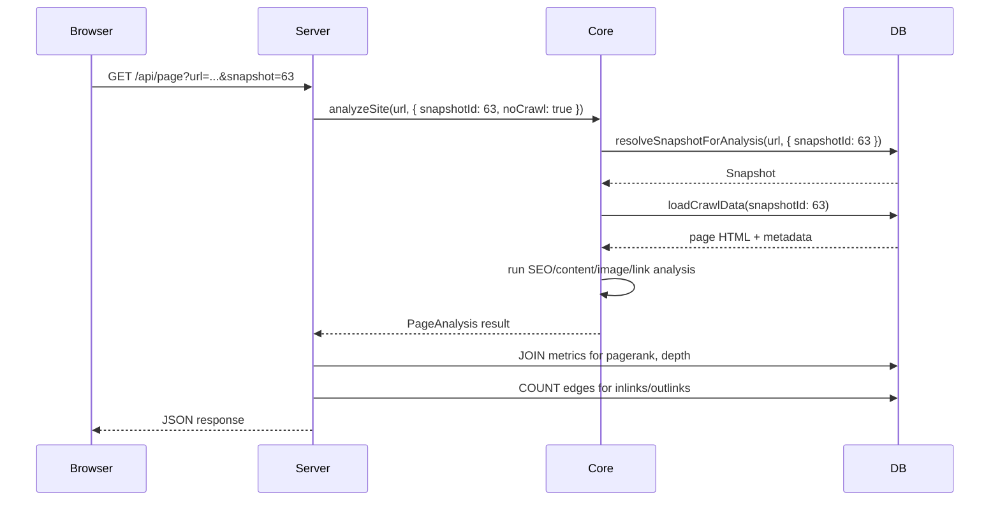

# Crawlith Architecture

> Modular crawl intelligence engine for deterministic SEO analysis.

## Overview

Crawlith is a monorepo-based CLI tool and web dashboard that crawls websites, builds internal link graphs, computes SEO metrics, and surfaces actionable insights. The architecture follows a **plugin-based, layered design** where the core engine is framework-agnostic and all analysis algorithms are independently swappable plugins.

```
┌─────────────────────────────────────────────────────────┐
│                      User Interfaces                     │
│  ┌──────────┐  ┌──────────┐  ┌────────────────────────┐ │
│  │   CLI    │  │  Server  │  │    Web Dashboard       │ │
│  │ (cmdr)   │  │(express) │  │    (React + Vite)      │ │
│  └────┬─────┘  └────┬─────┘  └────────────────────────┘ │
│       │              │                                    │
│       ▼              ▼                                    │
│  ┌─────────────────────────────────────────────────────┐ │
│  │              Plugin Registry (CLI)                   │ │
│  │  Assembles canonical set from @crawlith/plugin-*    │ │
│  └────────────────────┬────────────────────────────────┘ │
│                       ▼                                   │
│  ┌─────────────────────────────────────────────────────┐ │
│  │                  @crawlith/core                      │ │
│  │  Crawler · Graph · Analysis · DB · Plugin System     │ │
│  └─────────────────────────────────────────────────────┘ │
│                                                           │
│  ┌─────────────────────────────────────────────────────┐ │
│  │                    Plugins                           │ │
│  │  pagerank · hits · simhash · duplicates · clusters  │ │
│  │  heading-health                                      │ │
│  └─────────────────────────────────────────────────────┘ │
└─────────────────────────────────────────────────────────┘
```

---

## Package Map

| Package | Name | Purpose |
|---------|------|---------|
| `packages/core` | `@crawlith/core` | Engine: crawler, graph, DB, analysis, plugin contracts |
| `packages/cli` | `@crawlith/cli` | Commander-based CLI, assembles plugin registry |
| `packages/server` | `@crawlith/server` | Express REST API for the dashboard |
| `packages/web` | `@crawlith/web` | React + Tailwind dashboard UI |
| `packages/shared` | `@crawlith/architecture-shared` | Cross-cutting types (`CommandName`) |
| `packages/infrastructure` | `@crawlith/architecture-infrastructure` | Adapter layer (db, fetcher, logger, filesystem) |
| `packages/plugins/*` | `@crawlith/plugin-*` | Independent analysis plugins |

### Dependency Flow

```
plugins/* ──► core ◄── server ◄── cli ◄── web (bundled into cli)
```

- **Plugins** depend only on `core` (for types and utility functions).
- **Core** has zero knowledge of plugins — it defines contracts only.
- **CLI** is the wiring point: it imports all plugins and passes them to the engine.
- **Server** depends on `core` for analysis; it's bundled into CLI via `tsup`.
- **Web** is a standalone Vite/React app, copied into CLI's `dist/ui` at build time.

---

## Core Engine (`@crawlith/core`)

The core is organized into functional layers:

### Crawler Pipeline

```
URL → Fetcher → Parser → Normalizer → Graph Builder → Snapshot
```

| Module | File | Responsibility |
|--------|------|----------------|
| **Crawl Orchestrator** | `crawler/crawl.ts` | BFS traversal, depth/page limits, robots.txt |
| **Fetcher** | `crawler/fetcher.ts` | HTTP client with retry, rate limiting, proxy support |
| **Parser** | `crawler/parser.ts` | HTML parsing via Cheerio, link/meta extraction |
| **Normalizer** | `crawler/normalize.ts` | URL canonicalization, tracking param removal |
| **Sitemap** | `crawler/sitemap.ts` | XML sitemap discovery and parsing |
| **Trap Detection** | `crawler/trap.ts` | Infinite crawl loop prevention |
| **Metrics Runner** | `crawler/metricsRunner.ts` | Post-crawl metric computation pipeline |

### Graph & Algorithms

| Module | File | Responsibility |
|--------|------|----------------|
| **Graph** | `graph/graph.ts` | `Graph` class with nodes, edges, clusters |
| **PageRank** | `graph/pagerank.ts` | Link importance scoring |
| **HITS** | `scoring/hits.ts` | Hub/Authority scoring |
| **SimHash** | `graph/simhash.ts` | 64-bit locality-sensitive hashing |
| **Duplicate Detection** | `graph/duplicate.ts` | Exact/near/template-heavy duplicate clustering |
| **Content Clustering** | `graph/cluster.ts` | URL-pattern-based content grouping |

### Analysis Engine

| Module | File | Responsibility |
|--------|------|----------------|
| **Analyze** | `analysis/analyze.ts` | Single URL or snapshot-based page analysis |
| **SEO** | `analysis/seo.ts` | Title, meta, H1, canonical, noindex checks |
| **Content** | `analysis/content.ts` | Word count, text-to-HTML ratio, thin content |
| **Images** | `analysis/images.ts` | Alt text coverage analysis |
| **Links** | `analysis/links.ts` | Internal/external link ratio |
| **Structured Data** | `analysis/structuredData.ts` | JSON-LD / schema.org detection |

### Database (SQLite via better-sqlite3)

| Table | Purpose |
|-------|---------|
| `sites` | Tracked domains with settings |
| `snapshots` | Crawl snapshots (full, partial, incremental) |
| `pages` | Per-URL metadata, HTML, status codes |
| `edges` | Directed links between pages per snapshot |
| `metrics` | Per-page-per-snapshot computed metrics |
| `duplicate_clusters` | Grouped near/exact duplicates |
| `content_clusters` | URL-pattern-based content groups |

### Security & Safety

| Module | File | Responsibility |
|--------|------|----------------|
| **IP Guard** | `core/security/ipGuard.ts` | SSRF protection, private IP blocking |
| **Rate Limiter** | `core/network/rateLimiter.ts` | Request throttling |
| **Scope Manager** | `core/scope/scopeManager.ts` | Crawl boundary enforcement |
| **Lock Manager** | `lock/lockManager.ts` | Prevents concurrent crawls on same domain |

---

## Plugin System

### Contract

Every plugin implements the `CrawlPlugin` interface:

```typescript
interface CrawlPlugin {
  name: string;
  cli?: {
    flag?: string;           // --flag to enable
    description?: string;
    defaultFor?: string[];   // auto-activate for these commands
    optionalFor?: string[];  // available but opt-in
  };
  onInit?(ctx: PluginContext): Promise<void>;
  onBeforeCrawl?(ctx: CrawlContext): Promise<void>;
  onPageParsed?(page: ParsedPage, ctx: CrawlContext): Promise<void>;
  onGraphBuilt?(graph: SiteGraph, ctx: CrawlContext): Promise<void>;
  onMetricsPhase?(graph: SiteGraph, ctx: MetricsContext): Promise<void>;
  onAfterCrawl?(ctx: CrawlContext): Promise<void>;
  extendSchema?(schema: SchemaBuilder): void;
}
```

### Lifecycle Hooks

```
onInit → onBeforeCrawl → [crawl pages] → onPageParsed (per page)
       → onGraphBuilt → onMetricsPhase → onAfterCrawl
```

### First-Party Plugins

| Plugin | Package | Hook | Default For |
|--------|---------|------|-------------|
| PageRank | `@crawlith/plugin-pagerank` | `onMetricsPhase` | `crawl` |
| HITS | `@crawlith/plugin-hits` | `onMetricsPhase` | opt-in (`--compute-hits`) |
| Duplicate Detection | `@crawlith/plugin-duplicate-detection` | `onMetricsPhase` | `crawl` |
| Content Clustering | `@crawlith/plugin-content-clustering` | `onMetricsPhase` | `crawl` |
| SimHash | `@crawlith/plugin-simhash` | `onMetricsPhase` | `crawl` |
| Heading Health | `@crawlith/plugin-heading-health` | `onPageParsed` | `crawl` |

### Plugin Resolution

The CLI resolves which plugins are active per command:

```typescript
// plugins active if: defaultFor includes this command
//                 OR: optionalFor includes this command AND --flag is set
resolvePlugins(allPlugins, commandName, flags)
```

### Third-Party Plugins

External plugins can be loaded via the `PluginLoader`:
- **By path**: validated against a trusted root directory
- **By package name**: must use `crawlith-plugin-` prefix

---

## CLI Commands

| Command | Description |
|---------|-------------|
| `crawl <url>` | Full site crawl with BFS traversal |
| `page <url>` | Single URL on-page SEO analysis |
| `ui <domain>` | Launch the web dashboard |
| `probe <url>` | Transport layer / SSL / HTTP inspection |
| `sites` | List tracked sites and snapshot summaries |
| `clean <url>` | Remove crawl data for a site |

---

## Server API (`@crawlith/server`)

The Express server provides a REST API consumed by the web dashboard:

| Endpoint | Method | Purpose |
|----------|--------|---------|
| `/api/context` | GET | Site + snapshot context |
| `/api/overview` | GET | Dashboard summary metrics |
| `/api/issues` | GET | Paginated issue list |
| `/api/metrics/*` | GET | PageRank, depth, duplicates, etc. |
| `/api/snapshots` | GET | Snapshot timeline |
| `/api/page` | GET | Single page analysis (uses `analyzeSite`) |
| `/api/page/crawl` | POST | Trigger live crawl + analysis |

All data endpoints accept `?snapshot=<id>` to view historical data.

---

## Build Pipeline

```
pnpm build
  ├── @crawlith/web          → vite build → dist/
  ├── @crawlith/core         → tsc → dist/
  ├── @crawlith/plugin-*     → tsc → dist/
  └── @crawlith/cli          → tsup (bundles core + server + plugins + web UI)
                              → single dist/index.js binary
```

Key detail: `tsup` uses `noExternal` to bundle all workspace packages into a single ESM file. The web dashboard's built assets are copied into `dist/ui/` and served via Express static middleware.

---

## Data Flow: Full Crawl



---

## Data Flow: Dashboard Page View



---

## Testing

- **Framework**: Vitest v4
- **Coverage**: 267 tests across 50 test files
- **Core tests** (`packages/core/tests/`): Unit tests for every module — crawler, graph algorithms, DB operations, analysis, scoring, security
- **CLI tests** (`packages/cli/tests/`): Command output formatting, plugin activation, export runners
- **Test DB**: In-memory SQLite (`:memory:`) via `NODE_ENV=test`

Run all tests:
```bash
pnpm test
```

---

## Key Design Decisions

1. **Plugins are external packages, not inline code.** The canonical implementation of each algorithm lives in `packages/plugins/*`. Core exports only the contract (`CrawlPlugin` interface) and utility functions. The CLI assembles the registry.

2. **Single-binary distribution.** `tsup` bundles everything (core, server, plugins, web UI) into one `dist/index.js`. No runtime resolution of workspace packages.

3. **Snapshot-based historical analysis.** Every crawl produces an immutable snapshot. The dashboard can time-travel across snapshots. API endpoints accept `?snapshot=<id>`.

4. **SQLite for zero-config persistence.** No external database server required. WAL mode for concurrent reads. File stored at `~/.crawlith/crawlith.db`.

5. **Security-first crawling.** SSRF protection via IP guard, rate limiting, crawl-delay respect, domain scope enforcement, lock files to prevent concurrent crawls.
